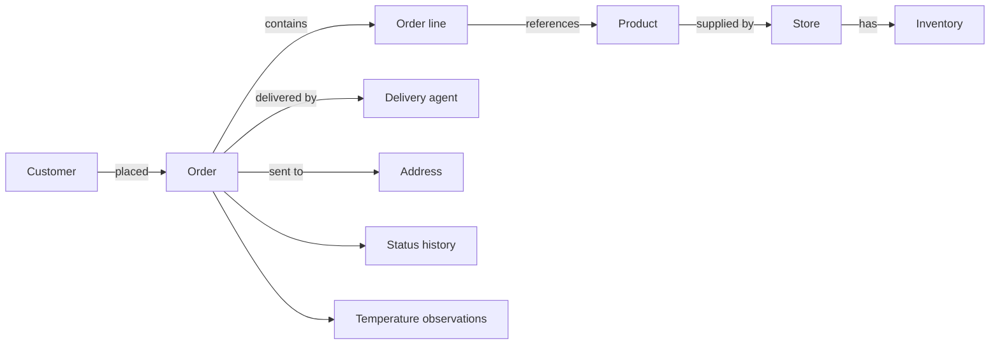

# Order Up Ontology

Order Up Ontology evolves a conventional commerce platform into one that can understand the meaning and relationships behind customers, stores, products, inventory, orders, deliveries, and returns.

> The goal is not to let AI bypass business rules. AI reads context, reasons, and proposes an action; deterministic services validate and commit it.

## What becomes possible?

A request such as **“Why is my order delayed, and what can we do?”** is not answered from one database row. The ontology connects the order to its line items, products, supplying store, inventory, delivery agent, destination, status history, and temperature observations. AI can use that grounded context to explain the situation and propose safe next steps.



## Ontology-enabled non-deterministic use cases

These experiences accept natural language or uncertain business situations. The ontology supplies structured, permission-scoped facts; AI interprets intent and generates an explanation or recommendation.

### Customer

| Use case | What the experience can do |
|---|---|
| **“Why is my order delayed?”** | Correlate order status, store readiness, delivery assignment, destination, and relevant observations to produce a grounded explanation and recovery options. |
| **“Can I get 5% off?”** | Let the customer negotiate with a store agent. The AI considers basket size, margin guardrails, demand, inventory age, and loyalty, then proposes an allowed offer. |
| **“Find a substitute that arrives sooner.”** | Understand product equivalence and constraints, then rank available alternatives from suitable stores instead of relying only on keyword matches. |
| **“Is anything in my order at risk?”** | Explain availability, fulfilment, or cold-chain risks connected to individual order lines and suggest permitted changes. |
| **“Reorder something similar but cheaper.”** | Use purchase history, product relationships, availability, and preferences to assemble transparent alternatives. |

### Store manager

| Use case | What the experience can do |
|---|---|
| **Attention queue** | Prioritize orders needing human action by combining fulfilment state, customer impact, inventory, and delivery risk. |
| **Abandonment explanation** | Identify plausible patterns behind lost baskets using product, price, availability, and customer context—clearly labeling conclusions as recommendations, not facts. |
| **Restock recommendation** | Combine product relationships, current stock, demand signals, lead time, and spoilage risk to suggest what and how much to replenish. |
| **Contextual offer** | Recommend an offer for a particular customer and basket within deterministic discount, margin, and eligibility rules. |
| **Product image assistance** | Generate an editable product image suggestion from SKU context while keeping publishing under store control. |

### Delivery agent

| Use case | What the experience can do |
|---|---|
| **Stop priority** | Recommend which delivery needs attention first using promised time, route state, item sensitivity, and customer impact. |
| **Unusual-delivery explanation** | Summarize why a delivery appears risky by connecting its order, address, status, and observations. |
| **Next-order briefing** | Produce a concise, persona-safe summary of pickup, destination, handling needs, and known exceptions. |
| **Failure recovery** | Suggest allowed next actions for access, recipient, or product-condition problems without silently changing an order. |

### Platform operations

| Use case | What the experience can do |
|---|---|
| **On-time delivery root-cause analysis** | Explore relationships across stores, products, inventory, locations, agents, and status events to surface recurring causes. |
| **Cold-chain pattern discovery** | Find clusters of temperature observations associated with products, routes, stores, or delivery outcomes. |
| **Policy impact simulation** | Explain which customers, stores, and orders may be affected before a fulfilment or discount policy changes. |
| **Cross-domain anomaly detection** | Highlight combinations that look unusual across otherwise separate operational systems for human review. |

## What is deterministic and what is non-deterministic?

| Layer | Responsibility | Examples |
|---|---|---|
| **Deterministic core** | Owns authoritative state and enforces rules with repeatable outcomes. | Authentication, authorization, prices, inventory mutation, order state transitions, discount limits, payment, audit records. |
| **Ontology / semantic layer** | Connects business entities and exposes grounded, persona-scoped context. It does not own transactional truth. | Customer → Order → Product → Store → Inventory → Delivery relationships. |
| **Non-deterministic intelligence** | Interprets language, evaluates ambiguous context, explains, ranks, and proposes. | Intent classification, delay explanations, negotiation dialogue, recommendations, summaries. |
| **Action gateway** | Converts a proposal into a validated command or rejects/escalates it. | Apply an approved discount, reserve a substitute, request manager review. |

The governing pattern is:

**AI proposes → policy validates → service executes → audit records.**

## Current implementation status

| Capability | Status | Details |
|---|---|---|
| Order Up domain vocabulary | **Working prototype** | Core commerce entities and their relationships are represented in the ontology. |
| Semantic projection from MySQL | **Working prototype** | MySQL remains the source of truth while transactional records are projected into semantic context. |
| Read-only semantic API | **Working prototype** | Context and availability endpoints support grounded exploration without mutating business data. |
| Persona-scoped semantic access | **Working prototype** | Context is constrained for customer, store, delivery, and platform-manager perspectives. |
| Customer-to-store-agent negotiation | **Working prototype** | The customer intent bar can start a negotiation preview; deterministic policy remains responsible for accepting an offer. |
| AI product image assistance | **Working prototype** | Store inventory editing can request and display generated product imagery using optional OpenAI configuration. |
| Intent bars for every mobile persona | **Partially enabled** | The shared UI is present; richer store and delivery workflows remain to be connected. |
| Event graph and temporal reasoning | **Roadmap** | Status and operational events will support better causality, prediction, and auditability. |
| Governed autonomous actions | **Roadmap** | Agents will execute only explicit, bounded tools after policy validation, with approval and audit controls. |

## Semantic API

The API currently exposes read-only context endpoints:

```text
GET /semantic/orders/:id/context
GET /semantic/products/:id/availability
GET /semantic/deliveries/:id/context
```

See [Semantic API documentation](orderlyinc-orderly_node_api/binita_orderlyinc-orderly_node_api-b06abde36f0a/SEMANTIC_API.md) and the [ontology vocabulary](orderlyinc-orderly_node_api/binita_orderlyinc-orderly_node_api-b06abde36f0a/app/ontology/orderup.ttl).

## Repository map

| Path | Purpose |
|---|---|
| `orderlyinc-orderly_node_api/binita_orderlyinc-orderly_node_api-b06abde36f0a` | Node.js API, MySQL integration, semantic projection, ontology, and tests. |
| `Orderly_admin` | React administration portal. |
| `Order-Up-mobile app` | Flutter customer, store-manager, and delivery application with web support. |
| `OrderUp_Ontology_Case_Study` | Architecture decisions, diagrams, ontology planning, and implementation history. |

For the design direction and rollout sequence, read [Architecture Plan Reference](OrderUp_Ontology_Case_Study/ARCHITECTURE_PLAN_REFERENCE.md).

## Configuration and secrets

- Keep `.env` files and Firebase platform configuration out of Git.
- Supply mobile/web configuration using Flutter `--dart-define` values.
- Configure `OPENAI_API_KEY` only on the API/server side; never ship it in a browser or mobile bundle.
- MySQL remains the transactional source of truth.

## Verification

Each application keeps its own test and run commands. Start with the README or package configuration inside the relevant subdirectory. Semantic API tests live with the Node.js API.
